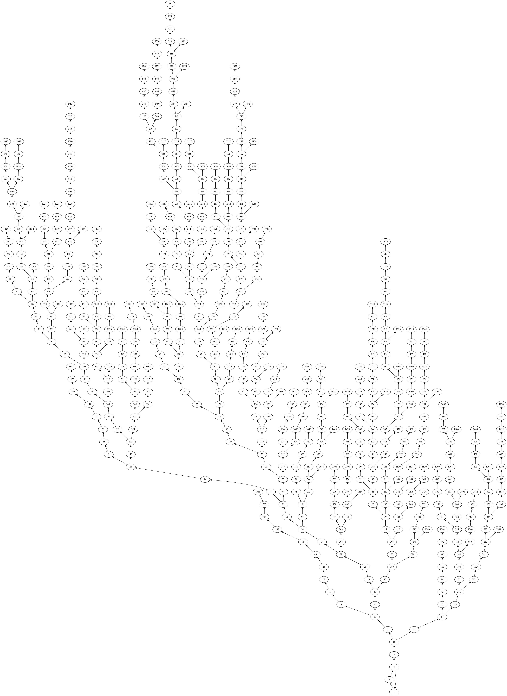
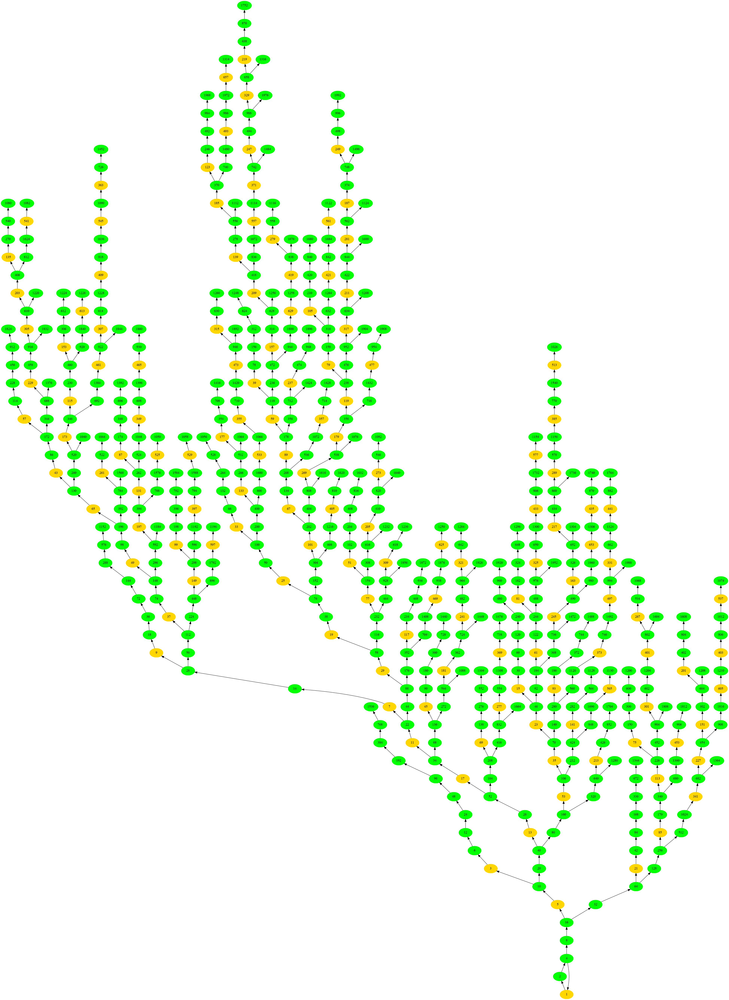

# collatz-conjecture (WIP)

The [Collatz conjecture](https://en.wikipedia.org/wiki/Collatz_conjecture),
also known as the 3n + 1 problem, is a mathematical conjecture that involves a
sequence of steps applied to a positive integer `n`.

Given a positive unsigned integer `n`, the following rules are applied:
- If `n` is even, divide it by 2.
- If `n` is odd, multiply it by 3 and add 1.

Repeating these rules by updating the value of `n` with each step will
eventually lead to `n` becoming equal to 1, regardless of the initial value of
`n`.

For example, if we start with `n` = 10:
```text
10 -> 5 -> 16 -> 8 -> 4 -> 2 -> 1
```

Despite its simplicity, the Collatz conjecture's behavior is not yet fully
understood and remains an unsolved problem in mathematics.

The purpose of this application is to give a toolbox to explore this problem
under different angles.

# To do list

A personal remainder on what to do:
- Add memoization for efficient bulk sequence computing.
- Improve tree rendering by putting the nodes with a small delta to the same
level.
- Display specific integers in the tree (perfect, semi-perfect, prime, etc).
- Compute steps densitiy for a group of sequences.
- Improve existing github workflow.
- Add markdown style comments to document code.
- Generalize CollatSequence to other forms (5x + 1, negative numbers, etc).

# Installation

## Additional dependencies

- for plotting: pkg-config libfreetype6-dev libfontconfig1-dev

# Usage

Use `-h` or `--help` for a summary of arguments and options.

## Sequence for a single number
To compute a Collatz sequence from a number n, use `--start` or `-s`:
```terminal
$ cargo run -- --start 10
CollatzSequence { hailstone: [10, 5, 16, 8, 4, 2, 1], starting_number: 10 }
```

## Plotting sequence
To compute a Collatz sequence from a number n, and plot it, use the same command
as above with `--plot` or `-p`. The plot will be saved as `sequence_from_n.png`,
where `n` is the starting number. For example:
```terminal
$ cargo run -- -s 27 -p && display sequence_from_27.png
```


## Bottom-up tree
To build the sequence in a reverse order from 1 to given n, use `--tree`  (or
its alias `-t`). You can also use `--tree-fancy` (or its short alias
`-T`) to create a colourful tree.

This will create the bottom-up tree and export it in a file named
`tree_to_n.dot`. This file can then be processed into an image with:
```terminal
$ cargo run -- -s 1000 --tree && \
  dot -Tpng tree_to_1000.dot > tree_to_1000.png
```
<table>
<thead>
  <tr>
    <th>--tree</th>
    <th>--fancy-tree</th>
  </tr>
</thead>
<tbody>
  <tr>
    <td></td>
    <td></td>
  </tr>
</tbody>
</table>

## Benchmarking
Use `-b` or `--benchmark` with a number to compare the efficiency of diverse
methods for computing all steps for the first n numbers. For example:
```terminal
$ cargo run -- -b 100
Time elapsed to compute steps on sequences from 1 to 100: 88.37µs
```
